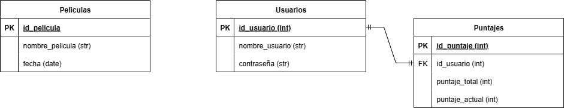

# 2025-TPIN-1-G14
Proyecto interdisciplinario

Primer cuatrimestre

Título de la propuesta: “¿Qué vino primero?”

Grupo: 14

División: B

Integrantes:
    -IGNACIO SALVADORI
    -IGNACIO IGLESIAS
    -DOLORES SOLÁ
    -JOAQUIN PERALTA

Descripción de la propuesta:

    “¿Qué vino primero?”

    Poné a prueba tu memoria cinéfila. Vas a ver dos películas
    enfrentadas, y tenés que adivinar cuál se estrenó primero. Parece
    fácil... hasta que no lo es.

    🎮 Cómo se juega:

        • Se te mostrarán dos películas.
        • Elegí cuál de las dos se estrenó antes.
        • Si acertás:
        • Sumás 1 punto.
        • La película correcta se mantiene y aparece una nueva para
            comparar.
        • Si fallás:
        • Tu racha se corta.
        • Se muestra el año real de estreno de ambas
        películas.
        • El objetivo es lograr la mayor cantidad de aciertos
        consecutivos.

    🏆 Sistema de puntaje:

        • +1 punto por cada acierto.
        • El puntaje total es tu racha actual.
        • Si fallás, el juego comienza de vuelta y el puntaje
        vuelve a 0.
        • El juego guarda tu mejor racha histórica.
        • En la pantalla final podras ver un ranking global de los mejores usuarios.

Alcance:

    -Crear y guardar usuarios
    -Guarde puntos en una tabla
    -Ranking de puntos

Tareas:

    1. Recopilación de los datos de cada película
    2. Diseño y creación de la base de datos
    3. Boceto de la GUI
    4. Back-end (Pedidos HTTP)
    5. Back-end (API Fetch)
    6. Front-end (HTML,CSS)
    7. Front-end (JS Login y registro)
    8. Front-end (JS Usuario admin)
    9. Front-end (JS)
    10. Testeo

Responsabilidades:
    1. Peralta
    2. Salvadori
    3. Iglesias
    4. Peralta y Salvadori
    5. Salvadori
    6. Iglesias y Solá
    7. Solá y Peralta
    8. Solá
    9. Solá
    10. Todos

Diagrama de Entidades de Relacion:

